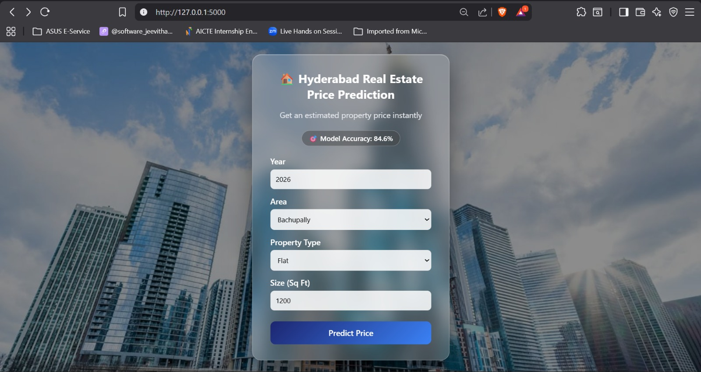

# 🏠 Telangana Real Estate Price Prediction System

A real-time machine learning web application that predicts property prices in Telangana based on historical data from 2020–2025.


---

## 📌 Project Overview

This project uses real-world real estate data to train a machine learning model that predicts property prices based on:
- Year
- Area
- Property Type
- Size (in Sq Ft)

The trained model is deployed using Flask to provide instant price predictions through a web interface.

---

## 🧠 Machine Learning Details

- **Problem Type:** Regression
- **Algorithm Used:** Random Forest Regressor
- **Evaluation Metric:** R² Score
- **Final R² Score:** ~0.85

- **Target Transformation:** Log-transformed price for better accuracy

---

## 📂 Dataset

- Data collected from **2020 to 2025**
- Total records: **1830**
- Data cleaning and merging done using Pandas
- Year-wise Excel files merged programmatically

---

## ⚙️ Tech Stack

- **Python**
- **Pandas & NumPy**
- **Scikit-learn**
- **Flask**
- **HTML, CSS**

---

## 🗂 Project Structure

```text
real_estate_project/
│
├── data/
│   ├── 2020.xlsx
│   ├── 2021.xlsx
│   ├── 2022.xlsx
│   ├── 2023.xlsx
│   ├── 2024.xlsx
│   └── 2025.xlsx
│
├── templates/
│   └── index.html
│
├── static/
│   └── style.css
│
├── merge_clean_data.py
├── model.py
├── app.py
├── clean_real_estate_data.xlsx
├── requirements.txt
├── README.md
└── venv/   (ignored)
